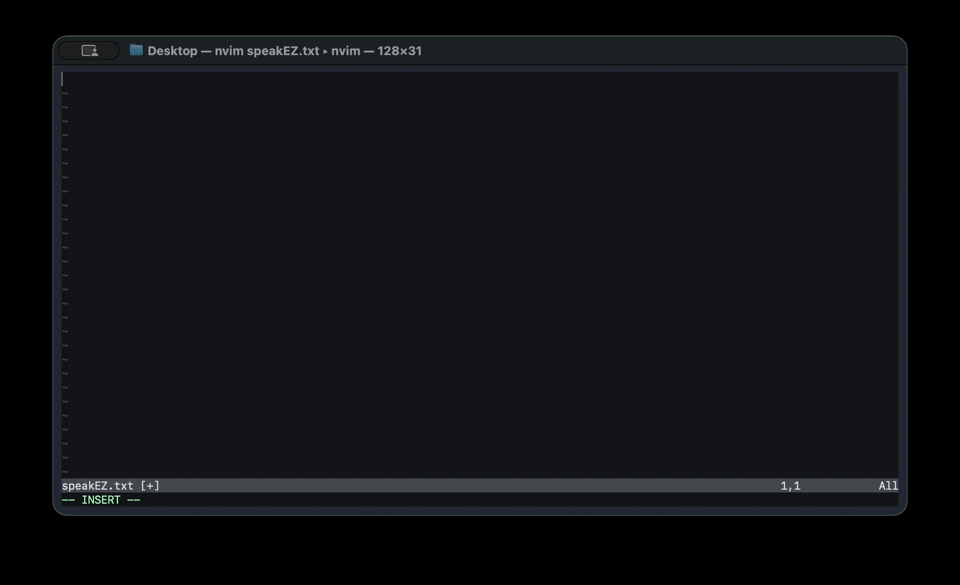

# speak-ez

Hold a key, talk, let go.
Clean text shows up wherever your cursor is.

The point of this app is the cleanup, not just the transcription.
Here is what that looks like:



The first line is refinement turned off: exactly what was said, ums included.
The second line is the same sentence dictated again with refinement on.

Everything runs on your Mac.
No account, no subscription, no telemetry, and nothing is ever uploaded.

## Install

```sh
brew install --cask axelvandenheuvel/tap/speakez
```

That installs a signed and notarized build.
If you would rather compile it yourself:

```sh
curl -fsSL https://raw.githubusercontent.com/AxelVandenHeuvel/speak-ez/main/install.sh | sh
```

The script builds from source (about 2 minutes, needs the Xcode Command Line Tools and offers to install them) and puts speakEZ.app in /Applications.
No Gatekeeper warnings either way; the source route just means you are not trusting a prebuilt binary.

On first launch you grant three permissions (Microphone, Input Monitoring, Accessibility), hit "Relaunch speakEZ" in the menu so macOS applies them, and let the speech model download once (~1 GB).

## How it works

Speech-to-text is NVIDIA's Parakeet v3 running on the Neural Engine, via [FluidAudio](https://github.com/FluidInference/FluidAudio).
It transcribes at roughly 50x real time on Apple Silicon: a normal dictation lands well under a second after you release the key, and even a full five-minute recording takes only a few seconds.

Cleanup has three levels, switchable from the menu bar:

- **Off**: you get the raw transcript.
- **Basic**: deterministic rules strip "um"/"uh" and stutters ("the the"), fix the punctuation seams, and apply your vocabulary. Adds zero latency.
- **AI**: Basic, then Apple's on-device foundation model fixes grammar and phrasing. This is the model that ships with Apple Intelligence, so there is nothing extra to download or configure. Needs macOS 26; otherwise it quietly falls back to Basic.

The refiner is told to clean, not rewrite.
If the model is slow or returns something that is not recognizably your sentence, you get the rules-based result instead.

## Vocabulary

Speech models mangle jargon.
Mine kept hearing "tea mux" for tmux, which is why this exists.

Menu bar -> "Add Vocabulary Term…", type the real spelling and optionally the mishearings:

- term: `tmux`, sound-alikes: `tea mux, teemux`
- term: `PostgreSQL`, sound-alikes: `postgres sequel`

Terms are also matched fuzzily (one edit away, same first letter), so "herder" becomes "herdr" without an alias.
Matching is deliberately conservative so ordinary words never get turned into your jargon.
It is all stored as plain JSON in `~/Library/Application Support/speakEZ/` if you would rather edit the file.

## Trigger key

Default is holding Right Option.
Held alone it triggers nothing in macOS, and if you press another key while holding it, the recording cancels and your shortcut goes through, so it cannot eat your keybinds.

You can change it in the menu: presets, or press any key or two-key combo (like ⌃S) after clicking "Set Custom Trigger Key…".
There is also a tap-to-toggle mode if you would rather not hold the key while talking.
Esc cancels a recording, and recordings cap at five minutes.

## Scripting

Anything that can open a URL can drive dictation, so you can wire it into Raycast, Apple Shortcuts, Keyboard Maestro, a Stream Deck button, or a foot pedal:

```sh
open "speakez://toggle"   # start recording; stop and insert if already recording
open "speakez://start"
open "speakez://stop"
open "speakez://cancel"
```

The binary also takes the same commands as flags (`/Applications/speakEZ.app/Contents/MacOS/speakEZ --toggle`).
Recordings started this way behave like tap-to-toggle: end them with another command, the trigger key in toggle mode, or Esc.

## Compared to similar projects

[OpenSuperWhisper](https://github.com/Starmel/OpenSuperWhisper), [VoiceInk](https://github.com/Beingpax/VoiceInk), and [Handy](https://github.com/cjpais/Handy) are all good local transcription apps, and some do things this one does not: more engines, more languages, transcribing audio files.

The difference here is the output.
Those tools give you what you said; this one gives you what you meant to type, and the AI pass uses the model already on your Mac instead of asking you to set up ollama or an API key.
If you want a transcription tool, use one of those.
If you want dictation that does not need manual cleanup afterwards, that is this.

## Roadmap

Things I am planning to build, roughly in order.
Open an issue if one of these matters to you; it helps me prioritize.

- [x] Dictation history in the menu bar: see what was heard vs what was typed, copy either
- [x] Granular cleanup toggles: fillers, stutters, vocabulary, and capitalization as independent switches
- [x] URL scheme and CLI (`speakez://toggle`) for Raycast, Keyboard Maestro, and scripts
- [ ] Per-app tone profiles: casual in Slack, formal in Mail, technical terms preserved in terminals and editors
- [ ] Keyword boosting: feed your vocabulary into the speech model itself for better jargon recognition
- [ ] Spoken self-correction: "meet at five, no wait, six" comes out as "Meet at six."
- [ ] Local context awareness: cleanup can see a few hundred characters around your cursor so on-screen names and terms are spelled right; stays on-device like everything else

## Requirements

- Apple Silicon Mac, macOS 14 or later.
- AI cleanup needs macOS 26 with Apple Intelligence enabled.
- Xcode Command Line Tools to build (no Xcode needed).

## Development

```sh
./Scripts/test.sh          # unit tests, no models or permissions needed
./Scripts/integration.sh   # real speech pipeline against a fixture recording
./Scripts/bundle.sh        # build speakEZ.app into build/
```

The pure logic (refinement rules, vocabulary matching, state machine) lives in `Sources/SpeakEzKit` with no AppKit or ML imports, so it is all unit-testable.
CI runs the tests and the full pipeline on every push.

## License

MIT. See NOTICE for model and library attributions.
